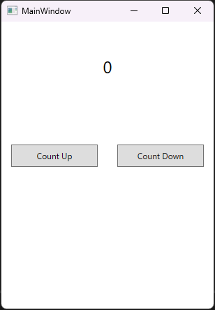
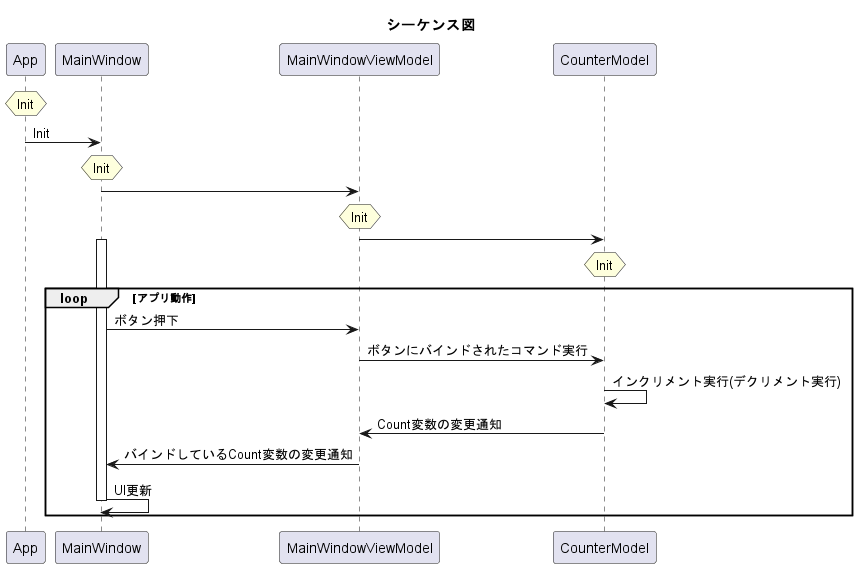
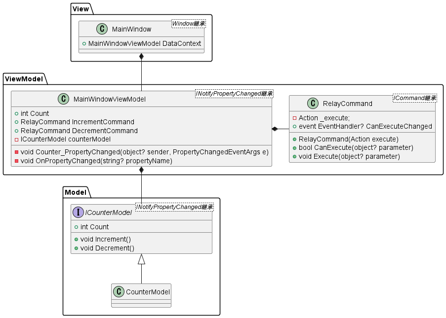

# MVVM サンプル

ごく単純なカウントアプリを MVVM で実装したもの。
ロジックと UI を分離し、Model と ViewModel を単体テストすることができるように設計した。

## それぞれのプロジェクト

- MvvmSample : アプリケーション本体のプロジェクト
- MvvmSample.Test : xUnit と moq を使用して簡単なテストコードを書いたプロジェクト

### MvvmSample: 動作画面

### MvvmSample: シーケンス図

大まかなシーケンス図を示す

### MvvmSample: クラス図

大まかなクラス図を示す

#### View

View はユーザーインターフェース（UI）を担当します。具体的には以下の役割を果たします。

- UI 描画：View はアプリケーションの UI（ユーザーが見る画面）を描画します。これにはボタン、テキストボックス、リストボックスなどの UI 要素が含まれます。
- データバインディング：View は ViewModel から提供されるデータを UI 要素にバインドします。「{Binding Sample}」のようなコードが該当します。これにより、ViewModel のデータが変更されたときに UI が通知を受け取り更新します。
- ユーザー操作のハンドリング：View はユーザーからの入力（ボタンのクリック、テキストの入力など）をハンドリングします。これらの操作は通常、View から ViewModel のコマンドにバインドされ、操作が発生したときにコマンドが実行されます。「Command="{Binding SampleCommand}"」のようなコードが該当します。

View は ViewModel にどのようなプロパティやコマンドが定義されているかを知っていなければなりません。
しかし、 ViewModel は View の詳細を知る必要はありません。

#### ViewModel

ViewModel は View と Model の中間に位置するもので、以下の役割を果たします。

- データバインディング：ViewModel は View に表示されるデータを保持します。このデータは通常、Model から取得され、View にバインドされます。ViewModel はこのデータの状態を管理し、変更があった場合は View に通知します。通知するためには INotifyPropertyChanged を継承し `PropertyChanged?.Invoke(this, new PropertyChangedEventArgs(propertyName));` のようなメソッドを呼び出す必要があります。
- UI ロジック：ViewModel は UI に関連するロジックを処理します。これにはユーザー操作のハンドリングや、View の表示状態（可視性、有効/無効など）の管理などが含まれます。
- コマンド：ViewModel は、ユーザー操作（ボタンのクリックなど）をハンドリングするためのコマンドを公開します。これらのコマンドは View からバインドされ、ユーザー操作に応じて実行されます。

ViewModel は Model に対して命令するため、ある程度 Model の実装を知る必要があります。
しかし、今回の例のようなインターフェースや抽象クラスを保持しておき、依存する Model を後から注入するといった設計にしておくことで Model との結合を必要最低限に抑え、コードの再利用性やテスト容易性を高めます。

#### Model

Model は、アプリケーションのビジネスロジックとデータ状態を担当します。

Model は以下の役割を果たします：

- データ管理：Model はアプリケーションのデータを管理します。これにはデータの永続化（データベースや外部ファイルへの保存）、データの取得、データの更新が含まれます。今回のアプリに Count 変数をデータベースに保存する実装を行うとすれば、この部分が必要になります。
- ビジネスロジック：Model はアプリケーションの実際の動作を実装します。これはデータの操作や検証、プロセスを管理するためのロジックを含みます。今回のインクリメント、デクリメントが該当します。
- エンティティの管理：Model はエンティティを管理します。エンティティは、アプリケーションのビジネスロジックを反映したデータの表現で、しばしばデータベースのテーブルをモデル化したものです。今回の Count が int 変数ひとつでなくなった場合に別のクラスとして定義することになり、それがエンティティになります。

Model は ViewModel や View から分離されているため、WPF などのプラットフォームや UI フレームワークに依存しないロジックを実装できます。これにより、Model のコードは再利用性が高く、テストも容易になります。
また、View-ViewModel の関係と同様に、Model が保持するデータを ViewModel に更新通知をする場合には INotifyPropertyChanged を継承することになります。
